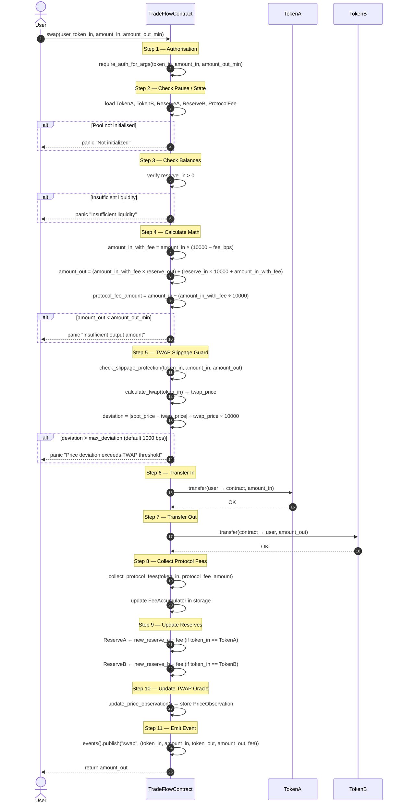

# Swap Execution Flow

This document provides a visual walkthrough of the complete smart contract lifecycle
for a token swap on TradeFlow, from the initial user call to the final on-chain event
emission.

## Sequence Diagram

## Step-by-Step Breakdown

| # | Step | Actor | Description |
|---|------|--------|-------------|
| 1 | **Authorisation** | TradeFlowContract | Granular auth — user must sign the exact tuple `(token_in, amount_in, amount_out_min)` to prevent front-running. |
| 2 | **Check Pause / State** | TradeFlowContract | Loads pool state (tokens, reserves, fee tier). Panics if the pool has not been initialised. |
| 3 | **Check Balances** | TradeFlowContract | Verifies the input-side reserve is non-zero. Panics with `"Insufficient liquidity"` otherwise. |
| 4 | **Calculate Math** | TradeFlowContract | Applies the constant-product AMM formula `(x · y = k)` with the protocol fee deducted from `amount_in` before the calculation. |
| 5 | **TWAP Slippage Guard** | TradeFlowContract | Compares the spot price implied by this swap against the rolling TWAP. Rejects swaps deviating more than `max_deviation` basis points (default 10 %). |
| 6 | **Transfer In** | TokenA | Pulls `amount_in` of the input token from the user into the contract vault. |
| 7 | **Transfer Out** | TokenB | Pushes `amount_out` of the output token from the contract vault to the user. |
| 8 | **Collect Protocol Fees** | TradeFlowContract | Splits off `protocol_fee_amount` and records it in the `FeeAccumulator` (used for buyback-and-burn). |
| 9 | **Update Reserves** | TradeFlowContract | Writes the new `ReserveA` and `ReserveB` values, net of collected fees, back to contract storage. |
| 10 | **Update TWAP Oracle** | TradeFlowContract | Records a new `PriceObservation` (timestamp, spot prices, cumulative prices) for future slippage calculations. |
| 11 | **Emit Event** | TradeFlowContract | Publishes the `swap` event containing `(token_in, amount_in, token_out, amount_out, fee)` for off-chain indexers and the frontend. |

## Key Formulas

**Constant-product output (fee-adjusted):**

$$
\text{amount\_out} = \frac{(\text{amount\_in} \times (10000 - \text{fee\_bps})) \times \text{reserve\_out}}{(\text{reserve\_in} \times 10000) + (\text{amount\_in} \times (10000 - \text{fee\_bps}))}
$$

**TWAP deviation check:**

$$
\text{deviation\_bps} = \frac{|\text{spot\_price} - \text{twap\_price}|}{\text{twap\_price}} \times 10000
$$

> Swap is rejected if $\text{deviation\_bps} > \text{max\_deviation}$ (default: **1000 bps = 10%**).

## Related Source Files

- Smart contract entry point: [contracts/tradeflow/src/lib.rs](../contracts/tradeflow/src/lib.rs)
- Fixed-point math utilities: [contracts/tradeflow/src/utils/](../contracts/tradeflow/src/utils/)
- Contract tests: [contracts/tradeflow/src/tests.rs](../contracts/tradeflow/src/tests.rs)
- TWAP Oracle documentation: [TWAP_ORACLE_DOCUMENTATION.md](../TWAP_ORACLE_DOCUMENTATION.md)
